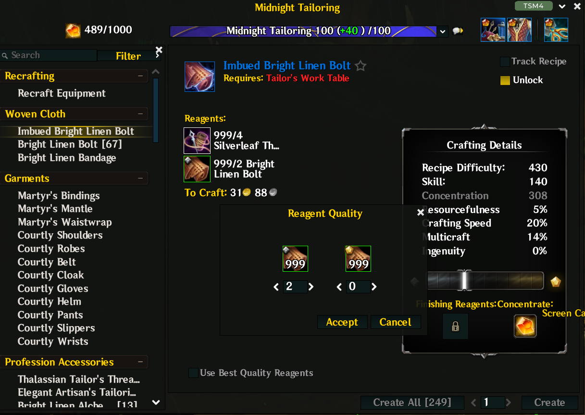

# SimpleCraftSim

World of Warcraft addon project.

Adds an unlock checkbox to the professions crafting UI and toggles a reagent-count override without requiring a UI reload.
The checkbox label is localized for English and Chinese clients.

## License

All Rights Reserved. See [LICENSE](LICENSE).
